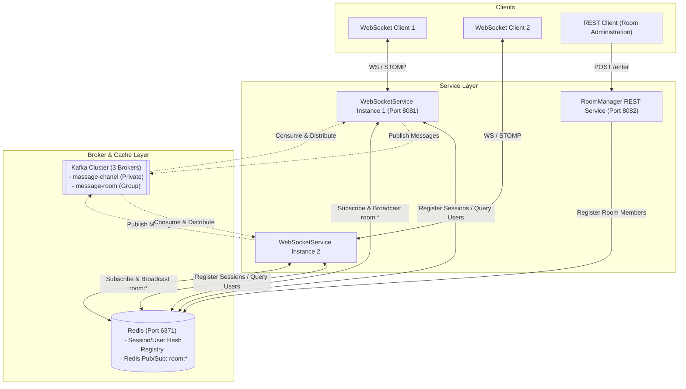

# ChatApp - Distributed Real-Time Messaging System

ChatApp is a scalable, real-time messaging application built with **Java (Spring Boot 3.x)**, **WebSockets (STOMP)**, **Apache Kafka**, and **Redis**. 

The system is designed to support private (one-to-one) messaging and group (room-based) chats, utilizing a multi-instance scaling strategy synchronized via Kafka broker topics and Redis Pub/Sub channels.

---

## 1. System Architecture Overview

The system runs in a distributed environment coordinated via Docker Compose. The relationship between clients, services, databases, and messaging infrastructure is illustrated in the diagram below:

### Infrastructure Components (Docker Compose)
- **ZooKeeper Cluster** (3 instances: `zookeeper_1`, `zookeeper_2`, `zookeeper_3`): Coordinates the Kafka brokers.
- **Apache Kafka Cluster** (3 instances: `broker_1`, `broker_2`, `broker_3`): Distributed commit log used for reliable message forwarding.
- **Kafka REST Proxy** (Port `8082`): Provides a RESTful interface to the Kafka cluster.
- **Redis Cache** (Port `6371` mapped from `6379`):
  1. Stores dual-indexed session-user mappings to track active clients across instances.
  2. Publishes and subscribes to room channels to synchronize room messages across clustered WebSocket servers.
- **Redis Insight** (Port `8083`): Graphical administrative interface for Redis database inspections.

---

## 2. Microservices Breakdown

The codebase is divided into two distinct Maven services under the root directory:

### A. RoomManager
`RoomManager` is a lightweight Spring Boot service configured to run on port `8082`. Its primary concern is managing user entrance to public chat rooms.

- **Technology Stack**: Spring Boot Web, Spring Data Redis, Jakarta Validation, Lombok.
- **Key Classes**:
  - [PublicRoomController.java](file:///D:/Projects/ChatApp/RoomManager/src/main/java/com/chatapp/RoomManager/RoomManager/controller/PublicRoomController.java): Exposes REST endpoint `POST /enter` receiving `PublicRoomRequest`.
  - [PublicRoomManagementService.java](file:///D:/Projects/ChatApp/RoomManager/src/main/java/com/chatapp/RoomManager/RoomManager/service/PublicRoomManagementService.java): Creates or joins rooms by writing user IDs into Redis Sets.
  - [RoomUtils.java](file:///D:/Projects/ChatApp/RoomManager/src/main/java/com/chatapp/RoomManager/RoomManager/service/RoomUtils.java): Performs read operations on Redis Sets (e.g., checking if a user is present in a room, fetching room users).
  - [Room.java](file:///D:/Projects/ChatApp/RoomManager/src/main/java/com/chatapp/RoomManager/RoomManager/model/Room.java) & [PublicRoomRequest.java](file:///D:/Projects/ChatApp/RoomManager/src/main/java/com/chatapp/RoomManager/RoomManager/model/PublicRoomRequest.java): Java Records defining data shapes.

### B. WebSoketService (WebSocketService)
`WebSoketService` is the core messaging processor running on port `8081`. It handles persistent WebSocket connections and pipes STOMP traffic.

- **Technology Stack**: Spring Boot WebSocket, Spring Kafka, Spring Data Redis Reactive.
- **WebSocket Configuration**:
  - [WebSocketConfig.java](file:///D:/Projects/ChatApp/WebSoketService/src/main/java/com/chatapp/WebSoketService/configration/WebSocketConfig.java): Registers endpoint `/websocket`, enables brokers for `/topic`, `/queue`, `/user`, and `/system`, and sets up inbound channel interceptors to validate and authorize subscriptions.
  - [SessionRegistryDecorator.java](file:///D:/Projects/ChatApp/WebSoketService/src/main/java/com/chatapp/WebSoketService/configration/SessionRegistryDecorator.java): Decorates the session connection logic. On success, it intercepts STOMP `CONNECTED` frames and injects the `session-id` header back to the client.
  - [WebSocketSessionRegistry.java](file:///D:/Projects/ChatApp/WebSoketService/src/main/java/com/chatapp/WebSoketService/configration/WebSocketSessionRegistry.java): Thread-safe in-memory map storing active connection handles.
- **Message Controllers & Handlers**:
  - [socketController.java](file:///D:/Projects/ChatApp/WebSoketService/src/main/java/com/chatapp/WebSoketService/controller/socketController.java): Exposes STOMP message mappings for joining, creating rooms, and messaging.
  - [UserConnectHandler.java](file:///D:/Projects/ChatApp/WebSoketService/src/main/java/com/chatapp/WebSoketService/service/UserConnectHandler.java): Authenticates connection requests. If the username is already occupied in Redis, it rejects the session.
  - [SessionDisconnectHandler.java](file:///D:/Projects/ChatApp/WebSoketService/src/main/java/com/chatapp/WebSoketService/service/SessionDisconnectHandler.java): Cleans up user-session indices from Redis upon socket disconnection.
- **Kafka Integration**:
  - [ProducerService.java](file:///D:/Projects/ChatApp/WebSoketService/src/main/java/com/chatapp/WebSoketService/service/ProducerService.java): Publishes messages asynchronously to Kafka topics (`massage-chanel` for private, `message-room` for group chats).
  - [ConsumerService.java](file:///D:/Projects/ChatApp/WebSoketService/src/main/java/com/chatapp/WebSoketService/service/ConsumerService.java): Subscribes to Kafka topics. When a message is consumed, it pushes it down to the corresponding client via WebSockets.
- **Cross-Node Room Synchronization**:
  - [RoomMessagePublisher.java](file:///D:/Projects/ChatApp/WebSoketService/src/main/java/com/chatapp/WebSoketService/service/RoomMessagePublisher.java): Publishes room messages to Redis pub/sub channel `room:<roomId>`.
  - [RoomMessageSubscriber.java](file:///D:/Projects/ChatApp/WebSoketService/src/main/java/com/chatapp/WebSoketService/service/RoomMessageSubscriber.java): Listens to all Redis room channels (`room:*`) and broadcasts messages to the local WebSocket broker topic `/topic/room/<roomId>`. This guarantees that users on different WebSocket server instances receive messages from the same room.

---

## 3. Communication & Message Flow

### A. One-to-One Private Chat
1. **Client A** sends a message to STOMP destination `/chat/hello/{userId}`.
2. **WebSocket Controller** receives it and calls `ProducerService.publishMassage(...)`.
3. The message is pushed to the Kafka topic **`massage-chanel`**.
4. **ConsumerService** on the target instance consumes the message from Kafka.
5. **ConsumerService** sends the message to the user queue `/queue/private` via `SimpMessagingTemplate.convertAndSendToUser()`.

### B. Group/Room Chat (Distributed Synchronization)
1. **Client A** sends a group message to STOMP destination `/chat/room`.
2. **WebSocket Controller** receives it and calls `ProducerService.publishToGroup(...)`.
3. The message is pushed to the Kafka topic **`message-room`**.
4. **ConsumerService** consumes the message from Kafka.
5. **ConsumerService** forwards it to `RoomMessagePublisher.publish(...)` which publishes the message to the Redis channel **`room:<roomId>`**.
6. Every active WebSocket node running `RoomMessageSubscriber` receives the Redis pub/sub message.
7. Each instance broadcasts the message to its locally connected WebSocket subscribers at **`/topic/room/<roomId>`**.

---

## 4. Current Code Issues / Compile Errors

During the codebase inspection, several syntax and logic anomalies were identified that would cause compilation failures:

### 1. Incomplete logic and syntax errors in `socketController.java`
- **Line 73**: `String userId = // get from session` is incomplete and lacks a terminating expression.
- **Line 81-82**: There is an unmatched closing brace `}` before the `sendToRoom` method, placing that method outside the `socketController` class boundaries.

### 2. Compile error in `RoomManagementService.java`
- **Line 36-47**: The `flatMap` lambda parameter `user -> { ... }` has no return statement. Reactive `flatMap` requires a return type of `Mono<Boolean>` or equivalent publisher.
- **Line 49**: There is a loose `return` statement with no expression.

### 3. Port Conflicts in `docker-compose.yml`
- Both the `rest_proxy` (Kafka REST Proxy) and the `RoomManager` microservice are configured to bind or occupy port **`8082`**. This will cause binding errors if both are run on the same network interface.
