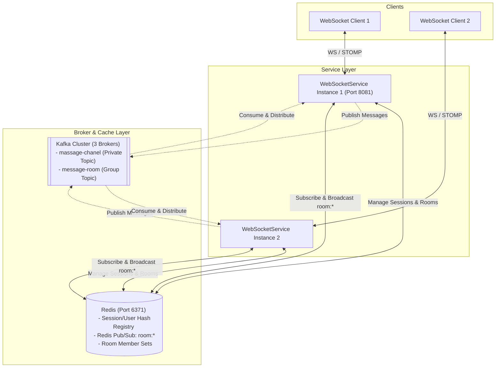

# ChatApp - Distributed Real-Time WebSocket Messaging Service

ChatApp is a highly scalable, real-time messaging backend application powered by **Java (Spring Boot 3.x)**, **WebSockets (STOMP)**, **Apache Kafka**, and **Redis**.

The service is designed to support high-throughput private (one-to-one) messaging and group (room-based) chats across a distributed multi-instance deployment. It utilizes Kafka broker topics to forward messages and Redis Pub/Sub channels to synchronize room broadcasts across all active nodes.

---

## Key Value Propositions & Selling Points

- 🚀 **Elastic Horizontal Scale-Out**: By externalizing session state and room registries to Redis, you can scale WebSocket servers from 2 to 200+ instances dynamically without dropping user connections or missing room messages.
- ⚡ **Sub-Millisecond Real-Time Latency**: Built with **Reactive Spring (Project Reactor)** and Lettuce, the system handles connection state and message broadcasts in a fully non-blocking manner with ultra-low latency.
- 🔒 **Secure-by-Design Group Channeling**: Subscription requests are intercepted in real-time, validating user session authenticity and room membership to prevent message leakage.
- 🛡️ **Zero-Loss Fault Tolerance**: Leveraging a 3-broker Apache Kafka cluster with active partition replication, `acks=all`, and idempotency configs, the application ensures message integrity and delivery guarantees.
- 🐳 **Cloud-Native & Production-Ready**: Comes out-of-the-box with Docker Compose configurations containing multi-node clusters, Zookeeper orchestration, and Redis Insight consoles, ready to be deployed to Kubernetes or AWS/GCP.

---

## 1. System Architecture Overview

The application runs in a distributed environment coordinated via [docker-compose.yml](file:///D:/Projects/ChatApp/docker-compose.yml). The relationship between clients, WebSocket instances, databases, and messaging infrastructure is illustrated in the diagram below:



### Infrastructure Components ([docker-compose.yml](file:///D:/Projects/ChatApp/docker-compose.yml))
- **ZooKeeper Cluster** (3 instances: `zookeeper_1`, `zookeeper_2`, `zookeeper_3`): Coordinates the Kafka brokers.
- **Apache Kafka Cluster** (3 instances: `broker_1`, `broker_2`, `broker_3`): Distributed message brokers providing partitions for horizontal scalability.
- **Kafka REST Proxy** (Port `8082`): REST interface to inspect or publish messages to the Kafka cluster.
- **Redis Cache** (Port `6371` mapped from `6379`):
  1. Stores dual-indexed session-user mappings to track active clients across instances.
  2. Tracks room metadata and member lists.
  3. Publishes and subscribes to room channels (`room:<roomId>`) to sync group messages across clustered WebSocket servers.
- **Redis Insight** (Port `8083`): Graphical administrative interface for Redis database inspections.

---

## 2. Microservice Architecture: WebSoketService

The core messaging processor is located in the [WebSoketService](file:///D:/Projects/ChatApp/WebSoketService) directory. It operates on port `8081` (configurable) and handles persistent WebSocket connections, piping STOMP traffic to Kafka and Redis.

### Technology Stack
- **Framework**: Spring Boot 3.x
- **WebSockets**: Spring STOMP messaging
- **Event Streaming**: Spring Kafka
- **In-Memory Store**: Spring Data Redis Reactive (Lettuce driver)

### Directory Structure & Component Mapping

#### A. Configurations
- [WebSocketConfig.java](file:///D:/Projects/ChatApp/WebSoketService/src/main/java/com/chatapp/WebSoketService/configration/WebSocketConfig.java)
  - Registers the `/websocket` STOMP endpoint.
  - Enables simple brokers for `/topic`, `/queue`, `/user`, and `/system`.
  - Configures the inbound channel interceptor to enforce subscription security rules (e.g., rejecting unauthenticated or unauthorized destinations).
- [SessionRegistryDecorator.java](file:///D:/Projects/ChatApp/WebSoketService/src/main/java/com/chatapp/WebSoketService/configration/SessionRegistryDecorator.java)
  - Intercepts incoming WebSocket connection handshakes to wrap the sessions.
  - Enhances `CONNECTED` frames with the `session-id` header back to the client.
- [WebSocketSessionRegistry.java](file:///D:/Projects/ChatApp/WebSoketService/src/main/java/com/chatapp/WebSoketService/configration/WebSocketSessionRegistry.java)
  - Thread-safe in-memory map storing active connection handles locally.
  - Tracks rejected sessions.
- [CustomHandshakeInterceptor.java](file:///D:/Projects/ChatApp/WebSoketService/src/main/java/com/chatapp/WebSoketService/configration/CustomHandshakeInterceptor.java)
  - Logs and captures request URIs during handshake phases.
- [RedisConfig.java](file:///D:/Projects/ChatApp/WebSoketService/src/main/java/com/chatapp/WebSoketService/configration/RedisConfig.java)
  - Connects to Redis via `LettuceConnectionFactory`.
  - Defines reactive templates (`reactiveRedisTemplate`) and standard templates (`redisTemplate`) for data access.
- [KafkaTopicConfig.java](file:///D:/Projects/ChatApp/WebSoketService/src/main/java/com/chatapp/WebSoketService/configration/KafkaTopicConfig.java)
  - Automatically provisions the Kafka topics: `massage-chanel` (10 partitions) and `message-room` (100 partitions).
- [KafkaProducerConfig.java](file:///D:/Projects/ChatApp/WebSoketService/src/main/java/com/chatapp/WebSoketService/configration/KafkaProducerConfig.java)
  - Configures idempotency, retries (3), and acknowledgement levels (`acks=all`) for reliable delivery.
- [KafkaConsumerConfig.java](file:///D:/Projects/ChatApp/WebSoketService/src/main/java/com/chatapp/WebSoketService/configration/KafkaConsumerConfig.java)
  - Sets up message listener container factories for both private and group messaging streams.
- [KafkaRebalanceListenerService.java](file:///D:/Projects/ChatApp/WebSoketService/src/main/java/com/chatapp/WebSoketService/configration/KafkaRebalanceListenerService.java)
  - Listens to partition reassignment events to dynamically track which node is consuming which partitions in Redis.

#### B. Controllers
- [socketController.java](file:///D:/Projects/ChatApp/WebSoketService/src/main/java/com/chatapp/WebSoketService/controller/socketController.java)
  - Exposes STOMP message endpoints for joining, sending messages, creating rooms, and joining rooms.

#### C. Services & Handlers
- [UserConnectHandler.java](file:///D:/Projects/ChatApp/WebSoketService/src/main/java/com/chatapp/WebSoketService/service/UserConnectHandler.java)
  - Validates and registers new users in Redis. Rejects connection attempts with usernames that are already taken.
- [SessionDisconnectHandler.java](file:///D:/Projects/ChatApp/WebSoketService/src/main/java/com/chatapp/WebSoketService/service/SessionDisconnectHandler.java)
  - Listens to `SessionDisconnectEvent` events and removes user-session mappings from Redis.
- [SessionConnectHandler.java](file:///D:/Projects/ChatApp/WebSoketService/src/main/java/com/chatapp/WebSoketService/service/SessionConnectHandler.java)
  - Logs session connection details upon initialization.
- [ProducerService.java](file:///D:/Projects/ChatApp/WebSoketService/src/main/java/com/chatapp/WebSoketService/service/ProducerService.java)
  - Publishes messages to the appropriate Kafka topics (`massage-chanel` and `message-room`).
- [ConsumerService.java](file:///D:/Projects/ChatApp/WebSoketService/src/main/java/com/chatapp/WebSoketService/service/ConsumerService.java)
  - Consumes private messages and routes them directly to users via WebSocket.
  - Consumes group messages and routes them to `RoomMessagePublisher` for Redis-wide distribution.
- [RedisService.java](file:///D:/Projects/ChatApp/WebSoketService/src/main/java/com/chatapp/WebSoketService/service/RedisService.java)
  - Manages dual-indexed session mapping hashes (`users` mapping `userId` -> `sessionId` and `sessions` mapping `sessionId` -> `userId`).
- [RoomManagementService.java](file:///D:/Projects/ChatApp/WebSoketService/src/main/java/com/chatapp/WebSoketService/service/RoomManagementService.java)
  - Orchestrates room creation, room membership sets, and room checks within Redis.
- [RoomMessagePublisher.java](file:///D:/Projects/ChatApp/WebSoketService/src/main/java/com/chatapp/WebSoketService/service/RoomMessagePublisher.java)
  - Verifies user membership in rooms and publishes group messages to the corresponding Redis channel (`room:<roomId>`).
- [RoomMessageSubscriber.java](file:///D:/Projects/ChatApp/WebSoketService/src/main/java/com/chatapp/WebSoketService/service/RoomMessageSubscriber.java)
  - Listens to Redis channels matching pattern `room:*` and broadcasts them to local STOMP subscribers.

#### D. Models
- [Message.java](file:///D:/Projects/ChatApp/WebSoketService/src/main/java/com/chatapp/WebSoketService/Model/Message.java)
  - POJO defining private messages (`from`, `to`, `text`).
- [GroupMessage.java](file:///D:/Projects/ChatApp/WebSoketService/src/main/java/com/chatapp/WebSoketService/Model/GroupMessage.java)
  - Java Record defining room messages (`from`, `msg`, `roomID`).
- [User.java](file:///D:/Projects/ChatApp/WebSoketService/src/main/java/com/chatapp/WebSoketService/Model/User.java)
  - Simple User record holding `userId`.
- [WebsocketResponse.java](file:///D:/Projects/ChatApp/WebSoketService/src/main/java/com/chatapp/WebSoketService/Model/WebsocketResponse.java)
  - Models system-to-client responses (`status`, `payload`).

---

## 3. Communication & Message Flows

### Connection & Authentication Flow
1. **Handshake**: The client initiates a WebSocket connection to the endpoint `/websocket`.
2. **Session Identification**: [SessionRegistryDecorator.java](file:///D:/Projects/ChatApp/WebSoketService/src/main/java/com/chatapp/WebSoketService/configration/SessionRegistryDecorator.java) intercepts the `CONNECTED` frame and appends the header `session-id:<id>` to the client's confirmation frame.
3. **Registration**: The client joins by sending a message to `/chat/join/{userId}`.
   - [UserConnectHandler.java](file:///D:/Projects/ChatApp/WebSoketService/src/main/java/com/chatapp/WebSoketService/service/UserConnectHandler.java) checks if the `userId` already exists in Redis.
   - If not, the session is registered in the Redis hash keys `users` and `sessions`. A `SUCCESS` response is pushed to `/user/queue/private`.
   - If it is already occupied, the session is marked as rejected in [WebSocketSessionRegistry.java](file:///D:/Projects/ChatApp/WebSoketService/src/main/java/com/chatapp/WebSoketService/configration/WebSocketSessionRegistry.java), and the connection is refused.

---

### Private (1-to-1) Message Flow
```
[Client A] 
    │
    ▼ STOMP Message to "/chat/hello/{userId}"
[WebSocket Controller (socketController)]
    │
    ▼ ProducerService.publishMassage(...)
[Kafka Topic: massage-chanel]
    │
    ▼ Consumed by ConsumerService
[ConsumerService]
    │
    ▼ messagingTemplate.convertAndSendToUser(targetUserId, "/queue/private", message)
[Client B (Subscribed to /user/queue/private)]
```

1. **Client A** sends a message to `/chat/hello/{userId}` containing `from`, `to`, and `text`.
2. **WebSocket Controller** receives the message and triggers `ProducerService.publishMassage(...)`.
3. The message is serialized and pushed to Kafka's **`massage-chanel`** topic.
4. **ConsumerService** on the instance hosting the target user's partition consumes the message.
5. **ConsumerService** extracts the recipient ID and sends the message directly using `SimpMessagingTemplate` to the user's destination **`/queue/private`** (maps to `/user/queue/private`).

---

### Room (Group) Message Flow
```
[Client A]
    │
    ▼ STOMP Message to "/chat/room"
[WebSocket Controller (socketController)] ── Verification (Is user in room?)
    │
    ▼ RoomMessagePublisher.publishMessage(...) -> Kafka
[Kafka Topic: message-room]
    │
    ▼ Consumed by ConsumerService -> Redis Pub/Sub
[Redis Pub/Sub Channel: room:<roomId>]
    │
    ▼ Heard by RoomMessageSubscriber (on all nodes)
[RoomMessageSubscriber]
    │
    ▼ messagingTemplate.convertAndSend("/topic/room/<roomId>", message)
[All Clients in Room (Subscribed to /topic/room/<roomId>)]
```

1. **Client A** sends a message to `/chat/room` with payload `GroupMessage(from, msg, roomID)`.
2. **WebSocket Controller** verifies that the user belongs to the room by invoking `roomManagementService.isUserInRoom(roomId, userId)`.
3. If verified, the controller publishes the message to the Kafka **`message-room`** topic.
4. **ConsumerService** consumes the message from Kafka and calls `roomMessagePublisher.publish(...)`.
5. **RoomMessagePublisher** broadcasts the message to the Redis Pub/Sub channel **`room:<roomId>`**.
6. Every active cluster instance running **RoomMessageSubscriber** receives the message from the Redis channel.
7. Each instance broadcasts the message to its locally connected STOMP subscribers on **`/topic/room/<roomId>`**.

---

## 4. Architectural Highlights, Trade-offs & Scaling Model

### A. Unique Architectural Characteristics
- **Hybrid Broker Topology (Kafka + Redis)**: Unlike traditional architectures that pick either Kafka or Redis, this project combines them. **Apache Kafka** functions as a highly durable, partitioned log for private and group message queues, handling long-term scalability and strict message delivery contracts. **Redis** serves as a lightweight, reactive in-memory database mapping session states and orchestrating low-latency local broadcasts via Redis Pub/Sub channels (`room:*`).
- **Dynamic Connection Session Registry**: WebSocket connections are notoriously difficult to scale in a clustered environment because a connection is tied to a single server instance. This architecture addresses this by implementing a dual-indexed mapping hash inside Redis (`users` and `sessions` keys) via [RedisService.java](file:///D:/Projects/ChatApp/WebSoketService/src/main/java/com/chatapp/WebSoketService/service/RedisService.java). This allows any node in the cluster to identify the server location of any user and safely handle session cleanup.
- **Kafka Rebalance Integration with Redis**: By utilizing [KafkaRebalanceListenerService.java](file:///D:/Projects/ChatApp/WebSoketService/src/main/java/com/chatapp/WebSoketService/configration/KafkaRebalanceListenerService.java), the system keeps Redis updated in real-time on which node is consuming which Kafka topic partitions.

---

### B. Scaling Advantages
- **Stateless Application Servers**: Since all user session data, active room lists, and room memberships are externalized in Redis, the WebSocket application servers (`WebSoketService`) are completely stateless. You can easily scale from 2 to 200 instances behind a load balancer without dropping active chat rooms or failing to deliver private messages.
- **High Partition Parallelism**: Private chat messages (`massage-chanel` with 10 partitions) and group chats (`message-room` with 100 partitions) are processed in parallel. Multiple instances can consume from these partitions concurrently, avoiding head-of-line blocking.
- **Ultra Low-Latency Broadcasts**: Instead of querying database tables or maintaining expensive peer-to-peer socket connections between WebSocket servers, the application publishes room messages directly to Redis Pub/Sub. Redis broadcasts these to all active instances in sub-millisecond times, letting each server instance focus purely on broadcasting to its locally connected clients.

---

### C. Architectural Trade-offs
- **Infrastructure Overhead**: Operating a multi-instance ZooKeeper cluster, a 3-node Kafka broker setup, and a Redis cluster adds operational complexity compared to running a simple in-memory STOMP broker (like Spring's built-in message broker).
- **Double Network Transfer for Group Chats**: A group message is sent to Kafka for durable partitioning, consumed by the handler, and then published to Redis Pub/Sub for local broadcast. This results in two network hops for every room message, increasing total network bandwidth.
- **Eventually Consistent Ordering**: Due to partition reassignment in Kafka and network delays across Redis channels, messages sent concurrently from different nodes might occasionally arrive out of chronological order at the client.
- **Redis Memory Growth**: Storing active user session metadata and room memberships in Redis means Redis memory usage scales linearly with the number of online clients. Proper session eviction strategies must be configured.

---

## 5. Configuration Details

The default configuration is maintained in [application.yml](file:///D:/Projects/ChatApp/WebSoketService/src/main/resources/application.yml):

```yaml
server:
  port: 8081
  id: server-1

spring:
  application:
    name: WebSoketService
  kafka:
    bootstrap-servers: ${KAFKA_CONN_BS:127.0.0.1:19092}
    topic:
      private: 'massage-chanel'
      group: 'message-room'
    consumer:
      group:
        user: 'massage-subscriber'
        room: 'group-massage-subscriber'
  websocket:
    session:
      timeout: 180
  redis:
    host: ${REDIS_HOST:127.0.0.1}
    port: ${REDIS_PORT:6371}
```

### Key Environment Variables
- `KAFKA_CONN_BS`: Bootstrap address of the Kafka cluster (default: `127.0.0.1:19092`).
- `REDIS_HOST`: Redis host name or IP address (default: `127.0.0.1`).
- `REDIS_PORT`: Redis port mapping (default: `6371` mapped to container `6379`).

---

## 6. Local Setup & Execution

### Prerequisites
- Docker & Docker Compose
- Java JDK 17 or higher
- Maven 3.x

### Step 1: Start Infrastructure Services
Spin up the Kafka cluster, ZooKeeper cluster, Redis cache, and REST proxies using Docker Compose:
```bash
docker-compose up -d
```
Verify that Redis is running on port `6371` and Kafka brokers are listening. You can access the **Redis Insight** dashboard at `http://localhost:8083`.

### Step 2: Build the WebSocket Service
Navigate to the WebSocket directory and compile the application:
```bash
cd WebSoketService
mvn clean install
```

### Step 3: Run the Service
Run the service locally:
```bash
mvn spring-boot:run
```
To run multiple instances, override the server port and ID:
```bash
mvn spring-boot:run -Dspring-boot.run.arguments="--server.port=8084 --server.id=server-2"
```

---

## 7. STOMP Protocol Handshake & Subscriptions Cheat Sheet

To test connections using raw STOMP clients (such as `stompjs` or terminal-based clients):

1. **Connect**:
   - URL: `ws://localhost:8081/websocket`
2. **Join / Authenticate Session**:
   - Destination: `/chat/join/user123`
   - Send empty payload.
3. **Subscribe to Private Messages**:
   - Destination: `/user/queue/private`
4. **Create / Join Rooms**:
   - Create Room: Send to `/chat/room/create/roomXYZ`
   - Join Room: Send to `/chat/room/join/roomXYZ`
5. **Subscribe to Room Messages**:
   - Destination: `/topic/room/roomXYZ`
6. **Send Room Message**:
   - Destination: `/chat/room`
   - Payload: `{"from": "user123", "msg": "Hello everyone!", "roomID": "roomXYZ"}`
